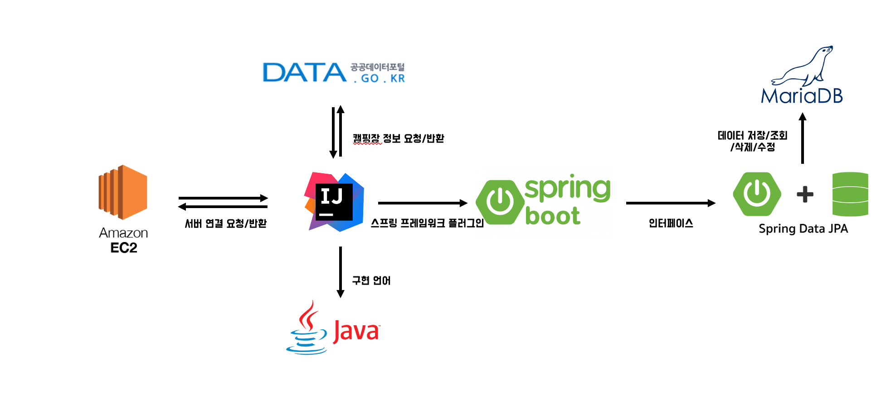
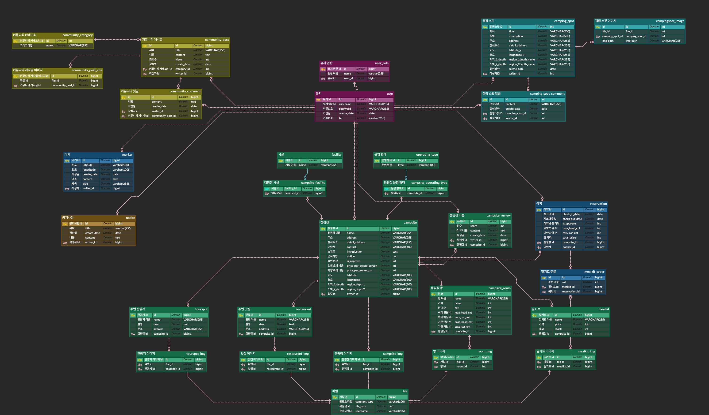

# 두더지 캠핑

### 캠핑장 및 캠핑스팟 정보 공유 플랫폼

# 1. 개요

<aside>
💡 최근 코로나 사태로 인한 캠핑/백패킹 등 소규모 야외활동이 급증했지만, 캠핑 전용 예약 플랫폼의 부재로 인해 번거로움이 존재한다. 캠핑장 예약 관리 플랫폼은 업주와 캠퍼들을 연결해 쉽게 예약을 진행하고 관리할 수 있는 환경을 제공한다. 기본적인 예약 기능 외에도 캠퍼들이 본인이 방문한 캠핑장 및 노지들을 지도에 표시한 캠핑지도를 만들 수 있다. 또한 캠퍼는 다양한 캠핑장의 가격을 쉽게 비교할 수 있고, 커뮤니티 게시판을 통해 다른 캠퍼들과 캠핑과 관련된 다양한 경험을 공유할 수 있다. 업주는 현지인의 관점에서 고른 믿음직한 주변 관광지, 맛집에 대한 정보를 제공할 수 있으며 본인의 캠핑장을 더 많은 고객들에게 노출시킬 수 있고, 예약을 관리할 수 있어 효과적인 숙박업 운영이 가능해진다.

</aside>

## 1.1 프로젝트명

DDG CAMP(캠핑장 및 캠핑스팟 정보 공유 플랫폼)

## 1.2 프로젝트 기간

- 프로젝트 기간 : 2021.11.01~ 2021.12.08

## 1.3 프로젝트 목적

<aside>
💻 캠핑장 정보를 쉽게 확인하고 커뮤니티를 통하여 다른 캠퍼들과 캠핑 관련된 다양한 경험 및 장소를 공유한다.

</aside>

## 1.4 프로젝트 기대효과

- 캠퍼들이 본인이 방문한 캠핑장 및 노지들을 지도에 표시한 캠핑지도를 만들 수 있다.
- 손 쉬운 예약 관리 및 합리적인 캠핑장 선택이 가능해진다.

## 1.5 기술스택

Spring boot, Maven,

<aside>
💻 Spring boot, Maven, MariaDB, Spring Data JPA, Tyhmeleaf, JQuery, Bootstrap, AWS EC2, AWS RDS

</aside>

# 2. 프로젝트 범위

## 2.1 작업 명세서

### 2.1.1 요구정의 단계

- 요구사항 정의
    
    [두더지캠핑_요구사항_명세서_v1.01.docx](%E1%84%83%E1%85%AE%E1%84%83%E1%85%A5%E1%84%8C%E1%85%B5%20%E1%84%8F%E1%85%A2%E1%86%B7%E1%84%91%E1%85%B5%E1%86%BC%2039fd260005dd4381a87d94823d244f3b/%EB%91%90%EB%8D%94%EC%A7%80%EC%BA%A0%ED%95%91_%EC%9A%94%EA%B5%AC%EC%82%AC%ED%95%AD_%EB%AA%85%EC%84%B8%EC%84%9C_v1.01.docx)
    

### 2.1.2 분석 단계

- 요구사항 분석

### 2.1.3 설계 단계

- 시스템 설계
    
    
    
- ERD 설계
    
    
    

[시스템설계_v1.02.pptx](%E1%84%83%E1%85%AE%E1%84%83%E1%85%A5%E1%84%8C%E1%85%B5%20%E1%84%8F%E1%85%A2%E1%86%B7%E1%84%91%E1%85%B5%E1%86%BC%2039fd260005dd4381a87d94823d244f3b/%E1%84%89%E1%85%B5%E1%84%89%E1%85%B3%E1%84%90%E1%85%A6%E1%86%B7%E1%84%89%E1%85%A5%E1%86%AF%E1%84%80%E1%85%A8_v1.02.pptx)

# 3. 시스템 구축 환경

## 3.1 HW 구성도

- 서버 구성 및 IP 현황
    - 현재 [localhost](http://localhost) 환경 → Coming Soon...

# 4. 시스템 구축

[https://github.com/wonjun1995/mole-camping](https://github.com/wonjun1995/mole-camping)

[TroubleShooting 관련 기록](%E1%84%83%E1%85%AE%E1%84%83%E1%85%A5%E1%84%8C%E1%85%B5%20%E1%84%8F%E1%85%A2%E1%86%B7%E1%84%91%E1%85%B5%E1%86%BC%2039fd260005dd4381a87d94823d244f3b/TroubleShooting%20%E1%84%80%E1%85%AA%E1%86%AB%E1%84%85%E1%85%A7%E1%86%AB%20%E1%84%80%E1%85%B5%E1%84%85%E1%85%A9%E1%86%A8%20e31734f8aa52419ba2506f385d7006c5.md)

[개발 관련 유용한 정보](%E1%84%83%E1%85%AE%E1%84%83%E1%85%A5%E1%84%8C%E1%85%B5%20%E1%84%8F%E1%85%A2%E1%86%B7%E1%84%91%E1%85%B5%E1%86%BC%2039fd260005dd4381a87d94823d244f3b/%E1%84%80%E1%85%A2%E1%84%87%E1%85%A1%E1%86%AF%20%E1%84%80%E1%85%AA%E1%86%AB%E1%84%85%E1%85%A7%E1%86%AB%20%E1%84%8B%E1%85%B2%E1%84%8B%E1%85%AD%E1%86%BC%E1%84%92%E1%85%A1%E1%86%AB%20%E1%84%8C%E1%85%A5%E1%86%BC%E1%84%87%E1%85%A9%2080eceb3eb49648b197764c9765413827.md)

## 4.1 구현 페이지

1. 메인페이지
2. 캠핑장 리스트 페이지, 캠핑장 상세 페이지
3. 캠핑스팟 리스트페이지, 캠핑스팟 상세페이지, 캠핑스팟 등록/수정 페이지
4. 캠핑여지도 페이지
5. 로그인,회원가입 페이지

## 4.2 구현 기능

1. 메인페이지
    1. 반응형 Nav Bar (item 별 반응 이벤트 적용)
    2. 이미지 슬라이더
    3. 캠핑장 검색 기능
2. 캠핑장 리스트, 상세 페이지
    1. 캠핑장 목록(공공데이터를 수집하여 DB에 수집 후 JPA 매핑하여 데이터 조회) 
    2. 지역 별 캠핑장 조회 기능(JPQL 사용하여 카테고리 생성)
    3. 캠핑장 검색
    4. 캐핑장 상세 → 캠핑장 위치 지도로 출력( KakaoMap api 사용하여 출력)
3. 캠핑스팟 리스트, 상세, 등록/수정 페이지
    1. 캠핑 스팟 목록 서버 통신하여 화면에 Render
    2. 캠핑 스팟 상세  구현
        1. 캠핑스팟 위치 지도로 출력(KakaoMap api 사용하여 출력)
        2. 캠핑스팟 주변 관광지, 마트, 약국, 편의점 등 편의시설 선택 시 화면에 마커로 render
    3. 캠핑 스팟 등록
        1. GPS위치 기반 등록 OR 도로명 주소 기반으로 캠핑 스팟 등록 구현
    4. 캠핑 스팟 수정/삭제
4. 캠핑여지도 기능
    1. 캠핑장, 캠핑스팟 정보 서버와 통신하여 지도 화면에 render
    2. 캠핑장, 캠핑스팟 검색 기능 구현
5. 로그인, 회원가입 페이지
    1. Spring Security 적용하여 권한에 맞게끔 화면 render
    2. 정규식 ID/비밀번호 적용
    3. 조건식 비밀번호 애니메이션 기능 적용

<aside>
💻 프로젝트로 인하여 좋았던 점

</aside>

🗂️  **새로운 기술 JPA**

JPA 기술을 사용하면서 DB의 객체화에 대한 개념을 많이 공부하게 되었고 JPA의 장점에 대하여 많이 알게 되었다. 

**🙋‍♂️ 개발 역량 상승**

JPA를 적용하면서 양방향 맵핑할 때의 주의할 부분이나 구글링하면서 부족했던 부분을 공부하면서 개발 역량을 상승 시키는 계기가 되었다. 

맡은 부분을 끝까지 책임지고 잘해야 한다는 생각을 가지고 하여 더 열심히 하게 되었고 하다보니 너무 재밌어서 새벽4시까지 했던 집요함도 기를 수 있었다. 

<aside>
💻 프로젝트를 하며 아쉬웠던 점

</aside>

**📍  프로젝트 Quality Control**

매일매일 기능개발 및 템플릿 디자인을 하였지만 실제로 git commit log나 문서로 남기지 않고 여러 가지의 기능을 개발한 후 업데이트를 하였기때문에 세분화하여 프로젝트를 진행하지는 않았다. 

앞으로는 매일매일 혹은 각각의 feat나 design마다 새로운 브랜치를 따서 기록을 남긴다거나 문서를 만든다거나 해서 개발의 문서화를 할 것이다.

📍  고도화 작업

현재 캠핑장에 대한 정보 혹은 실시간 예약 사이트로 링크를 넘겨주는 플랫폼인데 고도화 작업을 통하여 전국의 캠핑장에 대하여 실시간 예약이 가능하도록 개발할 것이다. 그리고 react Native를 공부하여 크로스 플랫폼으로 발전시킬 생각이다.